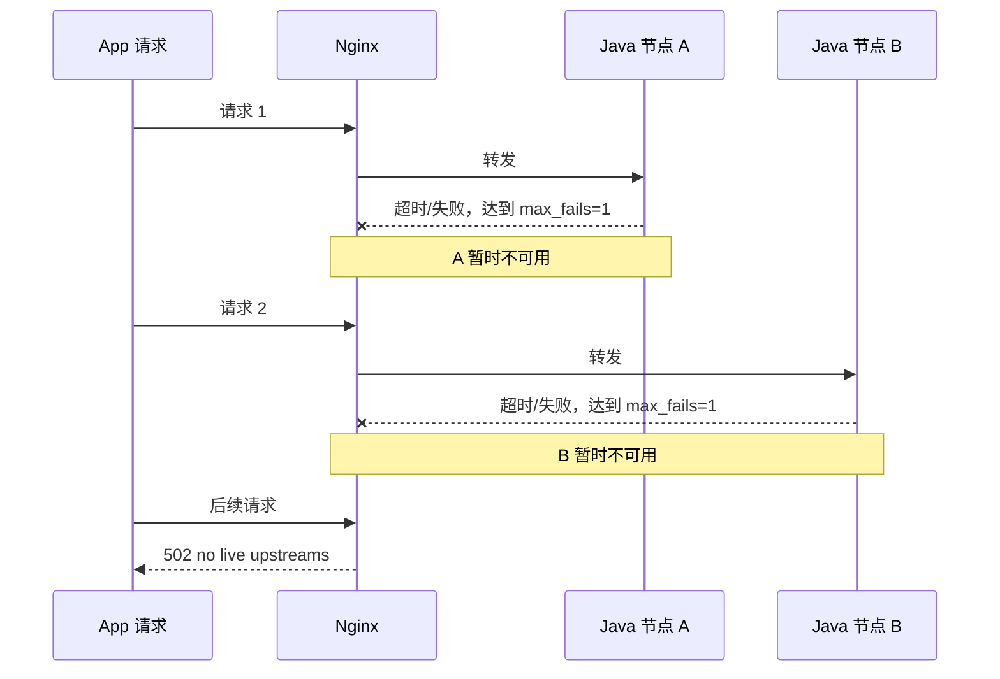

这次事故最值得记录的，不是最后改了哪一项配置，而是排查方向发生了两次转折：一开始怀疑 FCM 消费者耗尽了 Java 服务资源，随后从 Nginx 日志发现所有上游节点曾被同时摘除，最后又从 Druid 监控确认数据库连接池在高峰期长期满载。

FCM 不是这次 502 的直接根因，但它制造的突发流量会放大系统原有的容量问题。真正把“少量慢请求”升级为“大片请求立即 502”的，是过于激进的 Nginx upstream 失败策略。

## 一、事故发生时看到了什么

事故期间，Java 服务没有退出，FCM 消费日志仍在持续刷新，但 App 接口大面积返回 502。当天 FCM 链路收到了 10 万条以上的消息，真正推送成功的只有 2 万多条，大部分消息因为没有可推荐视频而被拒绝。

第一反应很自然：是不是消费者把数据库连接、Redis 连接或 JVM 工作线程占满，导致 App 请求一直拿不到资源，最终被网关判定超时？

这个推测有合理性，所以我先写了消费限流补丁，并在测试环境用 200 QPS 压测。限流开启后，其他接口仍能稳定响应。但这只能证明补丁具有保护作用，并不能证明 FCM 就是事故根因。

## 二、真正改变排查方向的一条日志

继续检查 Nginx error log 时，发现大量错误：

```text
no live upstreams while connecting to upstream
```

这句话不是“Java 接口返回了错误”，而是 Nginx 在转发前发现 upstream 中已经没有可选节点，于是直接返回 502。请求甚至可能还没有到达 Java 服务。

当时两台 Java 节点的配置类似下面这样：

```nginx
upstream video_tuber_api {
    server 10.0.0.11:8080 max_fails=1 fail_timeout=10s;
    server 10.0.0.12:8080 max_fails=1 fail_timeout=10s;
}
```

这里需要澄清一个很容易混淆的点：`fail_timeout=10s` 本身不等于“接口响应超过 10 秒就失败”。请求多久算超时由 `proxy_connect_timeout`、`proxy_read_timeout` 等配置决定；`fail_timeout` 控制的是失败统计窗口以及节点被判不可用的时间。哪些错误会计入失败，则与 `proxy_next_upstream` 等规则有关。

但在 `max_fails=1` 的情况下，只要一次符合条件的连接失败或超时被计入，节点就可能被暂时判不可用。两台机器在高峰期各出现一次慢请求，便可能同时退出候选列表：



于是，原本只影响某几个请求的慢接口，被网关策略放大成了持续一段时间的全站 502。

## 三、先止血：放宽失败容忍，再临时禁止摘除

确认机制后，第一步把配置调整为：

```nginx
server 10.0.0.11:8080 max_fails=20 fail_timeout=30s;
server 10.0.0.12:8080 max_fails=20 fail_timeout=30s;
```

这样不会因为一次偶发慢请求就立刻摘除节点。但晚上印度和巴西推送高峰到来时，仍观察到节点下线。为了优先保证接口可用性，随后临时改成：

```nginx
server 10.0.0.11:8080 max_fails=0;
server 10.0.0.12:8080 max_fails=0;
```

`max_fails=0` 会关闭被动失败统计。它适合作为事故止血手段，却不应被理解为最终方案：如果节点真的失去响应，流量仍可能继续打向故障实例。更完整的治理应该包含主动健康检查、合理的超时与重试边界、熔断降级，以及足够细的接口监控。

## 四、网关只是放大器，容量问题仍在数据库侧

Nginx 配置解释了“为什么会突然大片 502”，却没有解释“为什么两个节点会同时出现慢请求”。继续检查 Druid 数据源后发现，最大连接数只有 20，高峰期活跃连接数基本一直顶满。

这时因果链才完整：

```text
慢 SQL / 慢接口占用连接时间过长
        ↓
Druid 最大 20 个连接长期满载
        ↓
其他请求等待连接，接口响应时间继续上升
        ↓
Nginx 记录超时或失败
        ↓
max_fails=1 让两个节点先后被摘除
        ↓
no live upstreams，大量请求直接 502
```

数据源最大连接数随后从 20 提高到 40。这项调整是在配置中心完成的，不在本次代码提交中。它增加了缓冲空间，但连接池不是越大越好：上限还要结合 MySQL `max_connections`、实例数量、SQL 平均耗时和数据库 CPU/IO 压力一起验证。连接池扩容只能缓解排队，不能替代慢接口优化。

## 五、FCM 到底有没有关系

结论是：没有直接因果，但存在放大关系。

FCM 消费者与 App API 运行在同一个服务中，会共享数据库连接池、Redis 客户端、CPU 和线程资源。突发消息越多，越容易让一个本就接近上限的连接池进入满载。它更像压垮余量的外部流量，而不是 502 的唯一来源。

因此，给 FCM 限流、最终拆分异步服务仍然有价值；但如果只拆服务、不处理慢 SQL、SA 慢接口和 Nginx 摘除策略，事故条件依然存在。

## 六、这次事故后的处理顺序

我最终采用的顺序是：

1. FCM 消费限流，先压住突发流量。
2. 调整 Nginx 容错，避免全部 upstream 被轻易摘除。
3. 在数据库可承受范围内把 Druid 最大连接数从 20 调到 40。
4. 引入 Actuator、Prometheus 和 Grafana，定位真正的慢接口。
5. 优化 SA 风控链路，把平均耗时从 2 秒以上降到 100ms 以下。
6. 中长期再做读写分离与 FCM 服务拆分。

架构拆分当然重要，但事故处理不能只凭架构直觉。先用日志和指标还原因果链，再决定是调参数、改代码还是拆服务，通常会比“一上来就重构”更稳。

## 总结

这次事故至少暴露了三类问题：

- Nginx 的 `max_fails=1` 把单点慢请求放大成了全节点不可用。
- Druid 最大连接数 20 在高峰期没有余量，慢接口会引起请求排队。
- FCM 消费与 API 共用资源，突发流量缺少入口保护。

最初看到 FCM 失败日志时，我几乎把全部注意力放在消费者上。真正让排查走出误区的，是 Nginx 的 `no live upstreams`。线上故障中，最显眼的日志往往只是离现场最近的现象，而不是根因。
