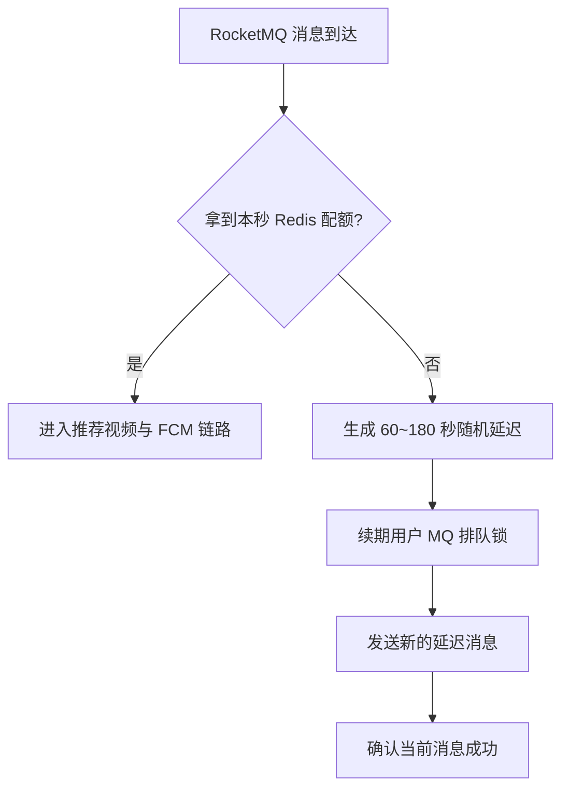

在 502 事故发生后的第一轮止血中，我给 FCM 消费链路增加了全局限流。虽然事后证明 FCM 不是 502 的直接根因，但这个补丁仍然解决了两个真实问题：双实例消费没有总量控制，以及大量没有推荐视频的用户被反复投递。

补丁对应的核心提交是：

```text
de4082d7  FCM 消费者添加限流控制
56c25d04  二次投递前校验是否有推荐视频
7880c8dd  token 被清理的用户不再二次投递
9bbdf7c9  非 B 用户拒绝并释放 MQ 推送锁
```

上线后，单日数据从“10 万多条消息、2 万多条成功”回落到“3 万多条消息、2 万多条成功”，无意义消费显著减少，推送成功率也逐步稳定。

## 一、为什么不能给每台机器各加一个 Semaphore

服务有两台实例。如果每台机器都在 JVM 内设置每秒 20 条，那么集群总吞吐会变成每秒 40 条；以后再扩容，限制还会继续失真。

因此限流必须是所有实例共享的。补丁使用 Redis 的原子 `INCR`，按服务器当前秒生成 key：

```java
private static final String RATE_KEY_PREFIX =
        "recommend:fcm:consumer:rate:";

String rateKey = RATE_KEY_PREFIX
        + (System.currentTimeMillis() / 1000);
Long currentCount = redisTemplate.opsForValue().increment(rateKey);

if (currentCount != null && currentCount == 1L) {
    redisTemplate.expire(rateKey, 2, TimeUnit.SECONDS);
}

return currentCount != null
        && currentCount <= maxConsumePerSecond;
```

实际生产配置把两台机器的总配额控制为每秒 20 条。代码里通过配置项读取，并保留默认值 30：

```properties
fcm.consumer.max-per-second=20
fcm.consumer.throttle-delay-min-seconds=60
fcm.consumer.throttle-delay-max-seconds=180
```

这个实现是固定窗口限流，不像令牌桶那样平滑，但它有三个优势：代码短、Redis 操作原子、双实例能看到同一个计数。对于先把高峰压住的事故补丁，足够直接。

## 二、限流必须发生在重资源链路之前

限流判断放在消费者入口，拿到许可后才进入后续逻辑：

```text
解析 userId
  → Redis 获取本秒许可
  → 推荐池查询与清理
  → 查询用户
  → 校验推送窗口
  → CDN / FCM 调用
```

如果先查数据库再限流，只限制了 FCM 的外部请求量，却没有保护最需要保护的数据库连接池。因此代码里明确在查库、Redis 推荐处理、CDN 和 FCM 之前获取许可。

## 三、超额消息不能直接失败，也不能立刻重试

超过配额的消息如果直接返回失败，RocketMQ 很可能快速重试，形成重试风暴；如果直接返回成功，消息又会丢失。

补丁采用“确认当前消息，再发送一条延迟消息”的方式：

```java
int delaySeconds = ThreadLocalRandom.current()
        .nextInt(minSeconds, maxSeconds + 1);

long nextDeliverTimeMs = System.currentTimeMillis()
        + TimeUnit.SECONDS.toMillis(delaySeconds);

refreshLockExpire(userId, delaySeconds + 600L);
producer.sendDelayedMessage(userId, nextDeliverTimeMs);
return ConsumeResult.SUCCESS;
```

这里有两个不能省略的细节。

第一，延迟时间不是固定值，而是在 60～180 秒内随机选择。如果所有超额消息都延迟 60 秒，它们会在一分钟后再次同时到达，形成新的尖峰。随机抖动可以把这一批消息打散。

第二，限流重投时不能释放用户的 MQ 排队锁，只能把锁的 TTL 刷新为“延迟时间 + 600 秒缓冲”。否则 Quartz Job 会在延迟消息到期前再次投递同一用户，制造重复消息。



## 四、真正浪费吞吐的是无效二次投递

限流解决“消费太快”，但当天 10 万多条消息只有 2 万多条成功，说明链路还存在“消息本来就不该进入队列”的问题。

消费者成功处理一次后，会计算下一次推送时间并再次投递。旧逻辑没有先判断用户是否还有推荐视频，所以一个已经耗尽推荐池的用户仍会不断收到延迟消息，等消费时才发现没有内容可推。

优化后，二次投递前用只读模式检查：

```java
if (recommendVideoPushService
        .findUnplayedVideo(userId, false) == null) {
    log.info("FCM投递MQ跳过 reason=无可推送视频 userId={}", userId);
    return;
}
```

`takeRecommendVideo=false` 的含义是“检查是否存在，但不取走”；实际消费时则传 `true`，选中的视频会从推荐池移除。

## 五、推荐池里还有一个容易忽略的小 BUG

推荐视频列表存在 Redis Hash 中，播放记录则通过独立 key 判断。旧实现只在消费成功时删除当前视频，却没有顺手清理已经确认播放过的视频。

这会产生一个隐蔽后果：Job 从推荐池判断“哪些用户还有视频可推”时，会把只剩已播放视频的用户也算进去，导致可推送用户集合虚高。

新逻辑用 `Iterator` 遍历列表：

```java
Iterator<VideoVo> iterator = videoList.iterator();
while (iterator.hasNext()) {
    VideoVo video = iterator.next();
    String playbackKey = "..." + userId + ":" + video.getVid();
    if (Boolean.TRUE.equals(redisTemplate.hasKey(playbackKey))) {
        iterator.remove();
        continue;
    }
    // 选择 index 最小的未播放视频
}
```

遍历结束后，只要列表发生变化就写回 Redis；列表为空则直接删除该用户在推荐池中的 Hash field：

```java
if (videoList.isEmpty()) {
    redisTemplate.opsForHash().delete(RECOMMEND_KEY, userId.toString());
} else {
    redisTemplate.opsForHash().put(RECOMMEND_KEY, userId.toString(), videoList);
}
```

这次修复不只是减少消费者失败日志，它还让 Job 侧的“可推送用户”判断重新变得准确。

## 六、随后补齐的终止条件

限流上线后又补了两类边界：

- FCM token 已被清理的用户，不再安排下一次投递。
- 非 B 应用用户拒绝推送，并释放 MQ 排队锁，避免用户长期卡在排队状态。

异步链路最容易出问题的地方，往往不是发送本身，而是“什么时候应该停止”。每一个终止分支都要明确决定：是否释放业务锁、是否确认 MQ、是否安排下一次投递。

## 七、固定窗口方案还有哪些边界

这个补丁解决了事故期的主要矛盾，但仍有后续优化空间：

- Redis 时间窗口依赖各应用服务器时钟，应保证 NTP 同步。
- `INCR` 与首次 `EXPIRE` 不是同一个 Lua 原子操作；极端情况下可能留下无 TTL key，不过 key 带秒级时间戳，不会影响后续窗口。
- 固定窗口在秒边界仍可能出现瞬时双倍流量，要求更平滑时可改成 Lua 令牌桶或滑动窗口。
- 延迟重投前最好监控重投量、队列堆积时间和用户去重率，而不是只看 FCM 成功数。

## 总结

这次 FCM 优化最后形成了三层保护：

1. Redis 秒级计数控制双实例总消费速率。
2. 超额消息随机延迟重投，并续期用户排队锁。
3. 投递前清理已播放视频，无推荐内容则终止链路。

限流只能控制速度，过滤才能减少总量。上线结果从 10 万多条消息降到 3 万多条、成功量仍维持在 2 万多条，说明真正有效的不是单纯把消费者“跑慢”，而是让无效消息尽早离开链路。
