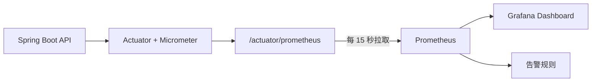

502 事故初期，我们能看到 FCM 错误日志、Nginx 超时和 Druid 连接池满载，却回答不了最关键的问题：究竟是哪个接口慢、慢到什么程度、什么时候开始变慢？

临时分析 Nginx access log 可以还原过去，但无法持续观察平均耗时、P95、吞吐量和状态码分布。因此我在项目中接入了 Spring Boot Actuator 和 Micrometer，由 Prometheus 定时拉取，由 Grafana 展示。

平台上线后的第一个明确结论是：SA 风控接口平均耗时超过 2 秒，P95 波动很大，峰值能达到 90 秒。此前“数据库连接池为什么长期满载”终于有了可定位的入口。

## 一、为什么只看平均值不够

假设 100 个请求里有 95 个耗时 100ms，另外 5 个耗时 30 秒，平均值已经很难描述用户体验。更重要的是，那 5 个长请求可能长期占用线程、数据库连接或其他依赖资源，最终拖慢更多请求。

所以接口监控至少要同时看：

- QPS：流量是否突然增加。
- 平均耗时：整体趋势是否恶化。
- P95/P99：尾部慢请求是否失控。
- 4xx/5xx：失败是否集中在某个 URI。
- JVM、线程池和数据库连接池：慢请求是否已经传导到资源层。

这次事故中，真正有诊断价值的是 P95，而不是“服务还活着”这一事实。

## 二、Java 侧接入 Actuator 与 Prometheus

提交 `5a6a7855` 在 `videoTuber-admin` 中加入两个依赖：

```xml
<dependency>
    <groupId>org.springframework.boot</groupId>
    <artifactId>spring-boot-starter-actuator</artifactId>
</dependency>

<dependency>
    <groupId>io.micrometer</groupId>
    <artifactId>micrometer-registry-prometheus</artifactId>
</dependency>
```

初始配置暴露了健康检查、指标和 Prometheus 端点，并为 HTTP 请求开启直方图、分位数与 SLO 桶：

```yaml
management:
  endpoints:
    web:
      exposure:
        include: health,info,metrics,prometheus
  metrics:
    tags:
      application: ${spring.application.name:video-tuber-admin}
    distribution:
      percentiles-histogram:
        http.server.requests: true
      percentiles:
        http.server.requests: 0.5,0.9,0.95,0.99
      slo:
        http.server.requests: 200ms,500ms,1s,3s,10s
```

第二天的提交 `50b964e0` 又把这段本地配置移除，改由配置中心统一管理。这样测试、生产可以使用不同的端点暴露范围和采样策略，也避免每次调整监控参数都重新打包。

安全配置中放行了 `/actuator/prometheus` 等采集端点。这里要特别注意：Spring Security 放行只解决 Prometheus 能否访问，不代表这些指标应该暴露给公网。生产环境还应通过安全组、Nginx allowlist 或独立管理端口，把访问范围限制在监控网络内。

## 三、Prometheus 如何拉取两台实例

Prometheus 采用 pull 模式，分别抓取两台 Java 服务：

```yaml
scrape_configs:
  - job_name: video-tuber-admin
    metrics_path: /actuator/prometheus
    scrape_interval: 15s
    static_configs:
      - targets:
          - 10.0.0.11:8080
          - 10.0.0.12:8080
```

给指标加上 `application` 标签后，同一套 Prometheus 中即使有多个 Spring Boot 服务，也能按应用过滤。`instance` 标签则保留节点维度，便于判断是某一台机器异常，还是两个节点同时变慢。

整体链路如下：



## 四、Grafana 面板里最有用的几条查询

Micrometer 导出的具体标签会随 Spring Boot 版本和 URI 归一化结果略有不同，先在 Prometheus 中检查实际指标名和 `uri` 标签。常见查询可以这样写。

### 1. 每个接口的 QPS

```promql
sum by (uri) (
  rate(http_server_requests_seconds_count{
    application="video-tuber-admin"
  }[5m])
)
```

### 2. 每个接口的平均耗时

```promql
sum by (uri) (
  rate(http_server_requests_seconds_sum{
    application="video-tuber-admin"
  }[5m])
)
/
sum by (uri) (
  rate(http_server_requests_seconds_count{
    application="video-tuber-admin"
  }[5m])
)
```

### 3. P95 耗时

```promql
histogram_quantile(
  0.95,
  sum by (le, uri) (
    rate(http_server_requests_seconds_bucket{
      application="video-tuber-admin"
    }[5m])
  )
)
```

### 4. 5xx 比例

```promql
sum(rate(http_server_requests_seconds_count{status=~"5.."}[5m]))
/
sum(rate(http_server_requests_seconds_count[5m]))
```

由于项目配置了 `200ms、500ms、1s、3s、10s` 的 SLO 桶，还可以直接观察请求落在哪个耗时区间。比单独展示一个 P95 数字更容易看出性能退化是逐渐发生，还是突然出现极端长尾。

## 五、监控如何把排查从“猜资源”变成“找接口”

平台上线前，排查方向主要围绕 MySQL 连接池、Java 线程和 Redis 超时。它们确实可能成为瓶颈，但仅看资源层无法回答是谁在消耗资源。

平台上线后，SA 接口的数据非常突出：

```text
平均耗时：2s+
P95：起伏明显
P95 峰值：约 90s
```

于是排查可以从 SA 入口继续下钻：每次请求写了哪些表、缓存命中后是否仍查库、IP 是否重复解析、第三方 ipinfo 花了多久、风控历史是否重复查询、老版本兼容逻辑是否仍在执行。

这就是接口指标的价值：它不直接告诉我们哪一行代码错了，但能把几十个“可能有问题的资源”收敛到一个具体调用链。

## 六、这套监控还缺什么

Actuator 的 HTTP 指标只能看到入口总耗时。要进一步区分“数据库慢”“Redis 慢”还是“ipinfo 慢”，还需要补充：

- Druid 活跃连接、等待线程数和获取连接耗时。
- MySQL 慢查询与 SQL digest。
- Redis 命令耗时和连接池等待。
- ipinfo 客户端请求次数、超时数与耗时直方图。
- RocketMQ 堆积量和 FCM 限流重投次数。
- 统一 traceId，串起 Nginx、Java、SQL 和外部 HTTP 调用。

特别是 SA 新用户在 Redis 没有 ipinfo 缓存时，必须访问外部服务。测试中这一段高延迟可超过 300ms。把外部依赖单独计时后，才能分清“SA 代码退化”和“第三方网络波动”。

## 总结

这次接入没有创造复杂的监控体系，只完成了一条最小闭环：

```text
Spring Boot 产出指标
→ Prometheus 定时存储
→ Grafana 展示 URI 级 QPS、平均值和 P95
→ 根据慢接口回到代码优化
```

它带来的最大变化，是以后再出现连接池满载时，不必先猜 FCM、JVM 还是 Redis。先看哪个接口的流量和尾延迟同时升高，再沿着这条链路检查数据库和外部依赖，排查会快得多。
